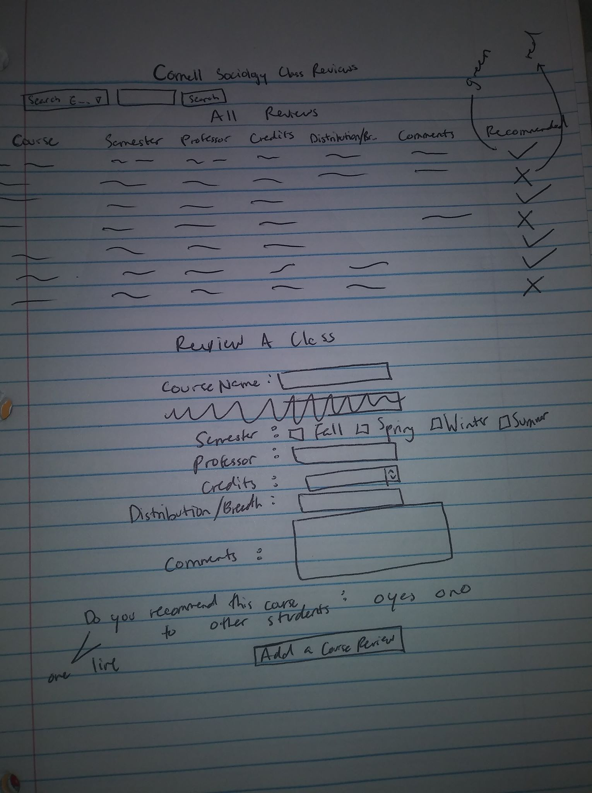

# Project 2: Design Journey

Be clear and concise in your writing. Bullets points are encouraged.

**Everything, including images, must be visible in VS Code's Markdown Preview.** If it's not visible in Markdown Preview, then we won't grade it.

## Catalog (Milestone 1)

### Describe your Catalog (Milestone 1)
> What will your collection be about? What types of attributes will you keep track of for the *things* in your catalog? 1-2 sentences.

My collection started off being a course catalog about Sociology classes at Cornell. It had the days the classes meet, the semester (fall or spring), the professor, number of credits, and any college or major requirements it can fulfill.To make it more user-engaging or a way to have users be able to add entries to the catalog, I am going to change it to a Cornell Sociology class reviews collection. That way it makes sense for users to add reviews and there's a need for it--since there's already the Cornell roster and ratemyprofessor.com reviews proffesors but not courses. It will have the course name, professor, semester, credit number, any college or major requirements it can fulfill, comments from the reviewer, and a yes/no to if they recommend it.


### Target Audience(s) (Milestone 1)
> Tell us about your target audience(s).

My target audience is current Cornell undergraduate students who are Sociology majors and want to take Sociology classes at Cornell or already took a Sociology class and want to leave a review.

### Design Patterns (Milestone 1)
> Review some existing catalog that are similar to yours. List the catalog's you reviewed here. Write a small reflection on how you might use the design patterns you identified in your review in your own catalog.

https://classes.cornell.edu/browse/roster/SP20/subject/SOC

The Cornell Sociology class roster for Spring 2020 is similar. A design pattern that I may use are the letters M, T, W, R, and F for the different days of the week.

http://courses.cornell.edu/content.php?catoid=31&navoid=7991

The Cornell Archived course catalog. I could use the design pattern of listing the classes by the shortened name SOC then "-" the number and the full name of the class.


## Design & Planning (Milestone 2)

## Design Process (Milestone 2)
> Document your design process. Show us the evolution of your design from your first idea (sketch) to design you wish to implement (sketch). Show us the process you used to organize content and plan the navigation, if applicable.
> Label all images. All labels must be visible in VS Code's Markdown Preview.
> Clearly label the final design.


First Design


Second Design


Third and final Design


## Partials (Milestone 2)
> If you have any partials, plan them here.

n/a

## Database Schema (Milestone 2)
> Describe the structure of your database. You may use words or a picture. A bulleted list is probably the simplest way to do this. Make sure you include constraints for each field.

Table: movies
- field 1: description..., constraints...
- field...

Table: courses(
    id: INTEGER{PK, U, Not, AI},
    course_name: TEXT{Not},
    semester: TEXT{Not},
    professor: TEXT{Not},
    credits: Integer{Not},
    reqs: TEXT{};
    comments: TEXT{};
    recommended: TEXT{Not};
)


## Database Query Plan (Milestone 2)
> Plan your database queries. You may use natural language, pseudocode, or SQL.]

1. All records

    ```
    SELECT * FROM courses
    ```

2. Search records

    ```
    SELECT * FROM courses WHERE (condition)
    ```

3. Insert record

    ```
    INSERT INTO(course_name, semester, professor, credits, reqs, comments, recommended)
    VALUES(:value1,:value2,:value3,:value4,:value5,:value6, :value7)
    ```


## Code Planning (Milestone 2)
> Plan any PHP code you'll need here.

Display all the elements of the database. For recommended, if it's yes, show a check mark. If it is no, show an X.
```
tr>
    <td><?php echo htmlspecialchars($courses["course_name"]); ?></td>
    <td><?php echo htmlspecialchars($courses["semester"]); ?></td>
    <td><?php echo htmlspecialchars($courses["professor"]); ?></td>
    <td><?php echo htmlspecialchars($courses["credits"]); ?></td>
    <td><?php echo htmlspecialchars($courses["reqs"]); ?></td>
    <td><?php echo htmlspecialchars($courses["comments"]); ?></td>

      <?php
      if (($courses["recommended"]) == "yes"){
        echo "<td class= \"yes\">✔</td>";
    }
    else if(($courses["recommended"]) == "no"){
      echo "<td class=\"no\">X</td>";
    }
    else {echo "<td class=\"other\">Not valid</td>";
    }
      ?>

  </tr>
```


if recommended is not equal to yes or no, then don't insert form. If course_name, professor, or credits aren't filled out, don't insert form.

```
if ($recommended != "yes" && $recommended != "no" ) {
   $valid_review = FALSE;
  }

  if ($course_name == ''){
    $valid_review=FALSE;
  }

  if ($professor == ''){
    $valid_review=FALSE;
  }

  if ($credits<= 0){
    $valid_review=FALSE;
  }
```


# Reflection (Final Submission)
> Take this time to reflect on what you learned during this assignment. How have you improved since Project 1? What things did you have trouble with?

I improved a lot on debugging. I learned how to use the $var_dump to figure out where my code was not working and I'm more patient. I also read through my code line by line multiple times during this project t see where I went wrong and translating code into English. I had trouble starting the code. Just knowing where to start was difficult.
